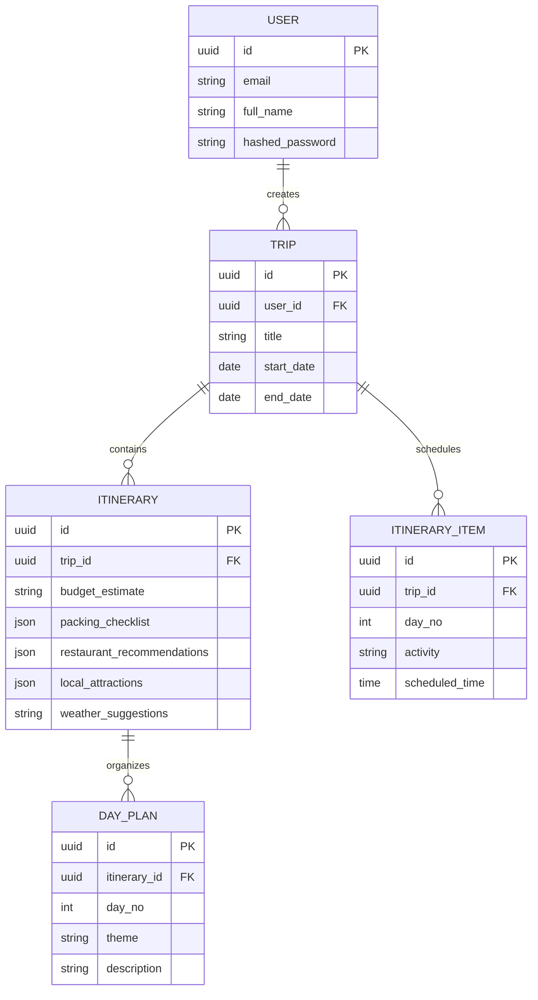

# TripMate 🌍✈️

**TripMate** is an advanced, AI-powered travel planning platform acting as your ultimate personal travel concierge. By leveraging cutting-edge LLMs via the Groq API and a robust Python/Next.js stack, TripMate dynamically constructs personalized itineraries, suggests weather-aware packing lists, and provides rich, interactive travel planning experiences.

> [!NOTE]
> TripMate is officially **Production Ready**. The platform features hardened global error handling, highly optimized database queries, accessible UI components, and complete Docker-based orchestration.

---

## 🏗️ Architecture

TripMate is built on a highly scalable, modern microservices architecture orchestrated via Docker Compose.

```mermaid
graph TD
    User([User / Browser]) -->|HTTP/REST| Frontend[Next.js Frontend]
    
    subgraph "Docker Compose Cluster"
        Frontend -->|HTTP/REST| Backend[FastAPI Backend]
        
        Backend -->|SQLAlchemy| DB[(PostgreSQL + pgvector)]
        Backend -->|Celery Tasks| Redis[(Redis Broker)]
        Backend -->|HTTP| MLService[ML Recommendation API]
        
        Redis -->|Pulls Tasks| Worker[Celery PDF Worker]
        Worker -->|Reads/Writes| DB
    end
    
    Backend -.->|External API| Groq[Groq API (Llama 3)]
    Backend -.->|External API| Weather[Weather/Currency APIs]
    Backend -.->|External API| Cloudinary[Cloudinary CDN]
```

## 🛠️ Tech Stack

### Frontend
- **Framework:** Next.js (React)
- **Styling:** TailwindCSS & shadcn/ui
- **State & Data:** React Query & Axios
- **Routing:** App Router

### Backend
- **Framework:** FastAPI (Python 3.13)
- **Database ORM:** SQLAlchemy 2.0 (Async)
- **AI Integrations:** Groq API (`llama-3.3-70b-versatile`) & LangGraph
- **Task Queue:** Celery & Redis
- **Observability:** Sentry & Logfire

### Infrastructure
- **Containerization:** Docker & Docker Compose
- **CI/CD:** GitHub Actions (Linting, Pytest, Playwright, Docker Build)
- **Database:** PostgreSQL (with `pgvector`)

---

## 🗄️ Database Schema

The core relational database is built on PostgreSQL. Below is an overview of the core Trip and AI Concierge models:



---

## 🚀 Quick Setup (Docker)

The fastest way to run TripMate in a production-like environment is via Docker Compose.

1. **Clone the repository:**
   ```bash
   git clone https://github.com/your-org/tripmate.git
   cd TripMate
   ```

2. **Configure Environment Variables:**
   ```bash
   cp backend/.env.example backend/.env
   # Open backend/.env and ensure you provide your GROQ_API_KEY
   ```

3. **Start the Cluster:**
   ```bash
   docker compose up --build
   ```

4. **Access the Services:**
   - **Frontend UI**: `http://localhost:3000`
   - **Backend API Docs (Swagger)**: `http://localhost:8000/docs`
   - **ML Service API**: `http://localhost:8001/docs`

---

## 🧪 Testing

TripMate boasts comprehensive test coverage across its core modules, ensuring robustness and stability.

### Backend Tests (Pytest)
Run the backend unit and integration test suite:
```bash
cd backend
source venv/bin/activate
PYTHONPATH=. pytest tests/
```
> [!TIP]
> The backend test suite fully mocks the Groq API, ensuring tests are deterministic and do not incur API costs.

### Frontend Tests (CI Validation)
Frontend builds and linting can be validated via standard npm commands:
```bash
cd frontend
npm run lint
npm run build
```

---

## 🌐 Deployment & CI/CD

TripMate is integrated with a full CI/CD pipeline via GitHub Actions (`.github/workflows/ci-cd.yml`). 

The pipeline automatically:
1. **Lints** both Python (Flake8) and TypeScript (ESLint) codebases.
2. **Tests** the backend via Pytest and frontend hooks.
3. **Builds** the Docker images for FastAPI, Next.js, and ML Services using caching to optimize build times.

For a live deployment, you can plug this pipeline into an AWS ECS cluster, DigitalOcean App Platform, or a simple managed Kubernetes cluster.

---

## 📚 Further Documentation

For deep dives into specific areas of the platform, refer to the guides in the `docs/` directory:

- 📖 **[API Documentation](./docs/API_DOCUMENTATION.md)**: Details on REST endpoints, authentication, and Swagger UI.
- 💻 **[Developer Guide](./docs/DEVELOPER_GUIDE.md)**: Instructions for setting up the local environment outside of Docker, running tests, and debugging.
- 🚢 **[Deployment Guide](./docs/DEPLOYMENT_GUIDE.md)**: Steps for deploying to production clusters and configuring the CI/CD pipeline.
- 🤝 **[Contributing Guidelines](./CONTRIBUTING.md)**: How to submit Pull Requests and adhere to code standards.
