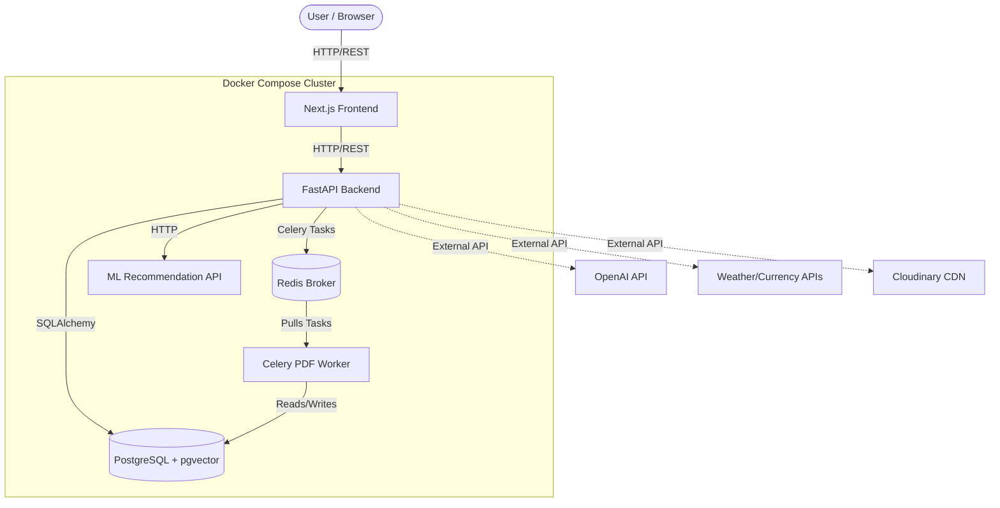
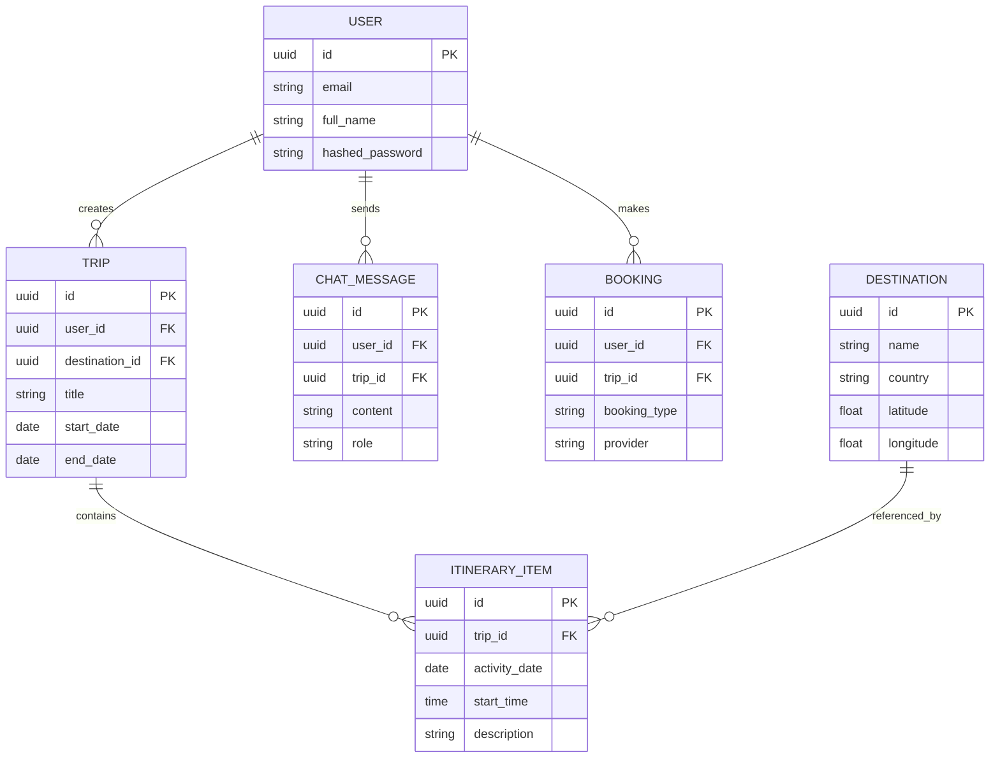

# TripMate 🌍✈️

**TripMate** is an advanced, AI-powered travel planning platform designed to act as your ultimate personal travel concierge. It leverages LangGraph and OpenAI to dynamically construct dynamic itineraries, integrates advanced computer vision models (YOLO11) for landmark detection, and provides personalized destination recommendations based on machine learning pipelines.

## 🏗️ Architecture

TripMate is built on a highly scalable, modern microservices architecture orchestrated via Docker Compose.



## 🗄️ Database Schema

The core relational database is built on PostgreSQL, utilizing `pgvector` for semantic RAG search capabilities.



## 📂 Folder Structure

```text
TripMate/
├── .github/                  # CI/CD GitHub Actions pipelines
├── backend/                  # FastAPI Application (Core Logic)
│   ├── app/                  # Application Source Code
│   │   ├── api/              # REST Endpoints
│   │   ├── core/             # Configuration & Security
│   │   ├── db/               # SQLAlchemy Models & Migrations
│   │   ├── modules/          # Domain Logic (Trips, Auth, Agent, PDF, Vision)
│   ├── tests/                # Pytest Unit & Integration Tests
│   └── Dockerfile            # Production Python Image
├── frontend/                 # Next.js Application (UI Layer)
│   ├── src/                  # React Components & Hooks
│   ├── e2e/                  # Playwright End-to-End Tests
│   ├── __tests__/            # Jest Unit Tests
│   └── Dockerfile            # Production Node.js Image
├── ml_service/               # ML Recommendation Engine (scikit-learn)
│   └── Dockerfile            # Standalone API Image
├── docs/                     # Supplemental Documentation
├── docker-compose.yml        # Orchestration Configuration
└── README.md                 # Project Overview (You are here)
```

## 🚀 Quick Setup (Docker)

The fastest way to run TripMate is via Docker Compose.

1. **Clone the repository:**
   ```bash
   git clone https://github.com/your-org/tripmate.git
   cd TripMate
   ```

2. **Configure Environment Variables:**
   ```bash
   cp backend/.env.example backend/.env
   # Open backend/.env and insert your OPENAI_API_KEY and CLOUDINARY credentials.
   ```

3. **Start the Cluster:**
   ```bash
   docker compose up --build
   ```

4. **Access the Services:**
   - **Frontend UI**: `http://localhost:3000`
   - **Backend API Docs (Swagger)**: `http://localhost:8000/docs`
   - **ML Service API**: `http://localhost:8001/docs`

---

## 📚 Further Documentation

For deep dives into specific areas of the platform, refer to the guides in the `docs/` directory:

- 📖 **[API Documentation](./docs/API_DOCUMENTATION.md)**: Details on REST endpoints, authentication, and Swagger UI.
- 💻 **[Developer Guide](./docs/DEVELOPER_GUIDE.md)**: Instructions for setting up the local environment outside of Docker, running tests, and debugging.
- 🚢 **[Deployment Guide](./docs/DEPLOYMENT_GUIDE.md)**: Steps for deploying to production clusters and configuring the CI/CD pipeline.
- 🤝 **[Contributing Guidelines](./CONTRIBUTING.md)**: How to submit Pull Requests and adhere to code standards.
